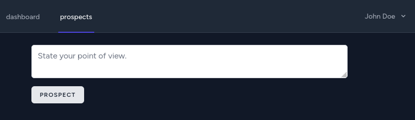

# delphic project

Brainstorming web application.

## scaffolding

```shell
composer create-project laravel/laravel delphic.rc0
cd delphic.rc0
composer require laravel/breeze --dev
php artisan breeze:install
```

Select framework React when prompted, then continue:

```shell
php artisan migrate:fresh
php artisan schema:dump
```

## it's time to develop brainstorming features

Now I will develop the functionality of the application in question that will allow users to register and share their ideas.

```shell
php artisan make:model -mrc Prospect
php artisan make:test ProspectFeatureTest
php artisan make:test ProspectUnitTest --unit
php artisan make:policy ProspectPolicy --model=Prospect
```

## after modifying the migration file related to table prospect

```shell
php artisan migrate:refresh --path=database/migrations/2023_03_03_101711_create_prospects_table.php
php artisan schema:dump
```

## to test the backend part of the application

```shell
php artisan test --profile
```

## now it's time to develop the user interface

```shell
mkdir resources/js/Pages/Prospects
touch resources/js/Pages/Prospects/Index.jsx
touch resources/js/Components/Prospect.jsx
```

## Laravel pages does not refresh?

At this point, after creating the Prospect index view and adding the link to the page, you will find that the dashboard does not refresh.
Thus, you will need to install package npm-watch:

```shell
npm i npm-watch
```

And edit the file package.json as follows.
Before:

```text
...
    "scripts": {
        "dev": "vite",
        "build": "vite build"
    },
...
```

And after the change:

```text
...
    "scripts": {
        "dev": "vite",
        "build": "vite build",
        "watch": "vite build --watch"
    },
...
```

Finally, in the root of the project it will be necessary to open two separate terminals.
The following command will be entered on the first one:

```shell
npm run watch
```

while the second terminal will be sent this other command:

```shell
php artisan serve
```

To have a further certainty of success, you can also disable the cache of the browser used during the development of the application.

## another set of useful commands

```shell
npm run dev
npm run build
```

A useful command to see the objects registered in the database is:

```shell
php artisan tinker
```

and, once in the tinker shell:

```shell
User::all();
Prospect::all();
```

## relative time reference

If you want to use a more colloquial present tense reference, you can install the following library:

```shell
npm i dayjs
```

## screenshots



## notes

In case you need to reset the contents of the entire database related to the application, you can type the following command:

```shell
php artisan migrate:refresh
```
